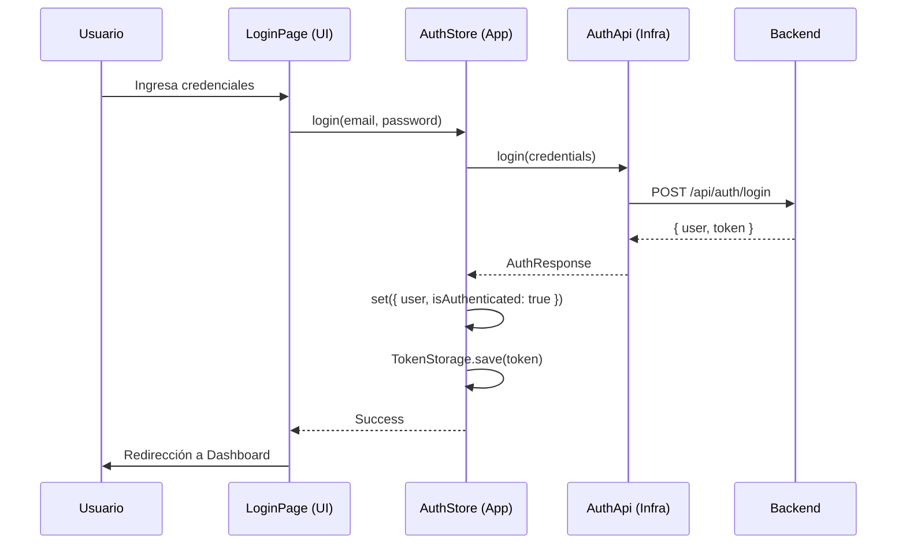
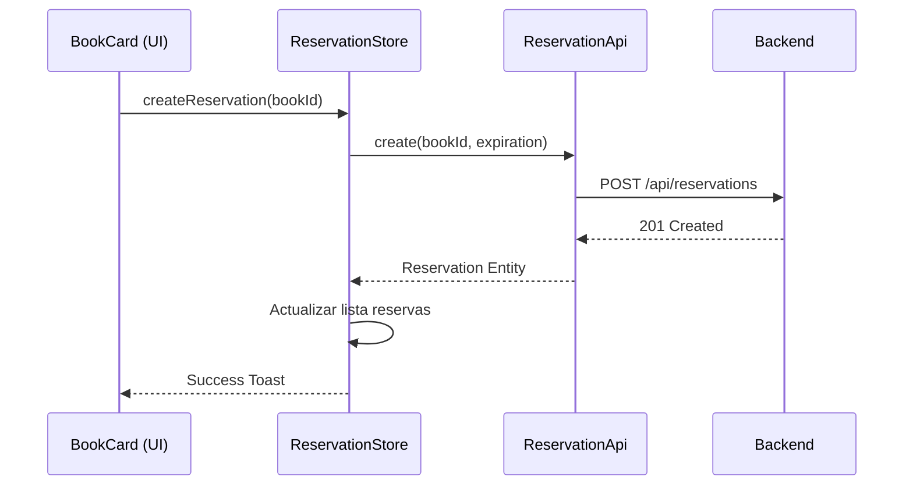

# Cliente de Gestión de Libros - Book Management Client

> Interfaz moderna y responsiva para el sistema de gestión de bibliotecas, construida con **React**, **TypeScript**, **Vite** y **TailwindCSS**. Implementa una **Clean Architecture** adaptada al frontend para garantizar escalabilidad y mantenibilidad.

---

## Tabla de Contenidos

1. [Características](#características)
2. [Requisitos Previos](#requisitos-previos)
3. [Instalación](#instalación)
4. [Configuración](#configuración)
5. [Ejecución](#ejecución)
6. [Arquitectura](#arquitectura)
7. [Patrones de Diseño](#patrones-de-diseño)
8. [Diagramas](#diagramas)
9. [Estructura del Proyecto](#estructura-del-proyecto)
10. [Tecnologías Utilizadas](#tecnologías-utilizadas)

---

## Características

### Funcionalidades Principales

- **Autenticación Segura** - Login y Registro con gestión de tokens JWT y persistencia segura.
- **Catálogo de Libros** - Exploración de libros con filtros, búsqueda y paginación.
- **Gestión de Reservas** - Flujo completo para reservar libros y visualizar estado (activa, expirada).
- **Mis Préstamos** - Seguimiento de libros prestados y fechas de devolución.
- **Interfaz Responsiva** - Diseño adaptativo para escritorio y móviles.
- **Feedback al Usuario** - Notificaciones toast para acciones exitosas y manejo de errores.
- **Validación de Formularios** - Robustas validaciones con Zod y React Hook Form.

---

## Requisitos Previos

Antes de comenzar, asegúrate de tener instalado:

- **Node.js** >= 18.x
- **npm** >= 9.x
- **Backend corriendo** (Ver README del backend)

Verifica las versiones:

```bash
node --version
npm --version
```

---

## Instalación

### Paso 1: Clonar el Repositorio

```bash
git clone <URL_DEL_REPOSITORIO>
cd frontend
```

### Paso 2: Instalar Dependencias

```bash
npm install
```

---

## Configuración

### Paso 1: Crear Archivo .env

Crea un archivo `.env` en la raíz del proyecto (basado en `.env.example`):

```bash
touch .env
```

### Paso 2: Configurar Variables de Entorno

```env
# URL de la API del Backend (Asegúrate que coincida con tu backend)
VITE_API_URL=http://localhost:3000/api
```

---

## Ejecución

### Modo Desarrollo

Para iniciar el servidor de desarrollo con recarga rápida (HMR):

```bash
npm run dev
```

La aplicación estará disponible en: `http://localhost:5173`

### Modo Producción

Para construir y probar la versión optimizada:

```bash
npm run build
npm run preview
```

---

## Arquitectura

El frontend sigue una adaptación de **Clean Architecture** para mantener la lógica de negocio desacoplada de la interfaz de usuario (React).

```
┌─────────────────────────────────────────────────────────┐
│                   PRESENTATION LAYER                    │
│  Components → Pages → Hooks → Routes                    │
│  (React, Tailwind, React Router)                        │
└────────────────────┬────────────────────────────────────┘
                     │
┌────────────────────▼────────────────────────────────────┐
│                   APPLICATION LAYER                     │
│  Stores (Zustand) → Use Cases (implícitos en stores)    │
│  (State Management, Logic Orchestration)                │
└────────────────────┬────────────────────────────────────┘
                     │
┌────────────────────▼────────────────────────────────────┐
│                     DOMAIN LAYER                        │
│  Entities → Repository Interfaces                       │
│  (Business Rules, Type Definitions)                     │
└────────────────────┬────────────────────────────────────┘
                     │
┌────────────────────▼────────────────────────────────────┐
│                  INFRASTRUCTURE LAYER                   │
│  API Clients (Axios) → Local Storage → Implementations  │
│  (External Communications)                              │
└─────────────────────────────────────────────────────────┘
```

### Capas

1.  **Domain**: Define los modelos centrales (`User`, `Book`, `Reservation`) y los contratos (`Interfaces`) que debe cumplir la infraestructura. No depende de ninguna otra capa.
2.  **Application**: Contiene la lógica de la aplicación y el estado global. Aquí usamos **Zustand** (`stores`) para manejar acciones como `login`, `fetchBooks`, que orquestan el flujo de datos.
3.  **Infrastructure**: Implementa los detalles técnicos. Aquí se encuentran las llamadas HTTP con **Axios** que implementan las interfaces del dominio, y el almacenamiento local (`TokenStorage`).
4.  **Presentation**: La capa de UI construida con **React**. Los componentes solo se preocupan por mostrar datos y capturar eventos, delegando la lógica a la capa de Aplicación (Stores).

---

## Patrones de Diseño

### 1. Repository Pattern (Adaptado)
Definimos interfaces en `domain/repositories` (ej. `IAuthRepository`) y las implementamos en `infrastructure/api` (ej. `AuthApi`). Esto permite cambiar la fuente de datos (Mock vs API Real) sin afectar a la UI ni a la lógica de negocio.

```typescript
// Domain
export interface IAuthRepository {
  login(credentials: LoginCredentials): Promise<AuthResponse>;
}

// Infrastructure
export class AuthApi implements IAuthRepository {
  async login(credentials: LoginCredentials): Promise<AuthResponse> {
    // ... axios call
  }
}
```

### 2. Global State Management (Store Pattern)
Utilizamos **Zustand** para centralizar el estado y la lógica de negocio. Los stores actúan como "Controladores" de la capa de aplicación, conectando la UI con la infraestructura.

```typescript
// Application (Store)
const useAuthStore = create((set) => ({
  user: null,
  login: async (creds) => {
    const user = await authApi.login(creds); // Usa Infra
    set({ user }); // Actualiza Estado
  }
}));
```

### 3. Adapter Pattern (Implícito)
La capa de infraestructura actúa como un adaptador que transforma las respuestas de la API externa en Entidades de Dominio limpias que la aplicación puede consumir de forma segura.

---

## Diagramas

### Flujo de Autenticación



### Flujo de Reserva de Libro



---

## Estructura del Proyecto

```
src/
├── application/         # Lógica de aplicación y estado
│   └── stores/          # Stores de Zustand (Auth, Book, Cart, etc.)
│
├── domain/              # Reglas de negocio y contratos
│   ├── entities/        # Definiciones de tipos (User, Book)
│   └── repositories/    # Interfaces para la infraestructura
│
├── infrastructure/      # Detalles técnicos externos
│   ├── api/             # Implementación de clientes HTTP (Axios)
│   └── storage/         # Persistencia local (LocalStorage)
│
├── presentation/        # Interfaz de Usuario (React)
│   ├── components/      # Componentes reutilizables (UI Kit)
│   ├── pages/           # Vistas principales (Rutas)
│   └── routes/          # Definición de navegación
│
└── shared/              # Utilidades compartidas
    └── types/           # Tipos globales y genéricos
```

---

## Tecnologías Utilizadas

- **Core**: [React 18+](https://react.dev/), [TypeScript](https://www.typescriptlang.org/)
- **Build Tool**: [Vite](https://vitejs.dev/)
- **Estilos**: [TailwindCSS](https://tailwindcss.com/)
- **Estado Global**: [Zustand](https://zustand-demo.pmnd.rs/)
- **Routing**: [React Router DOM](https://reactrouter.com/)
- **Formularios**: [React Hook Form](https://react-hook-form.com/) + [Zod](https://zod.dev/)
- **HTTP Client**: [Axios](https://axios-http.com/)
- **Iconos**: [Lucide React](https://lucide.dev/)
- **Notificaciones**: [Sonner](https://sonner.emilkowal.ski/) / Hot Toast

---
